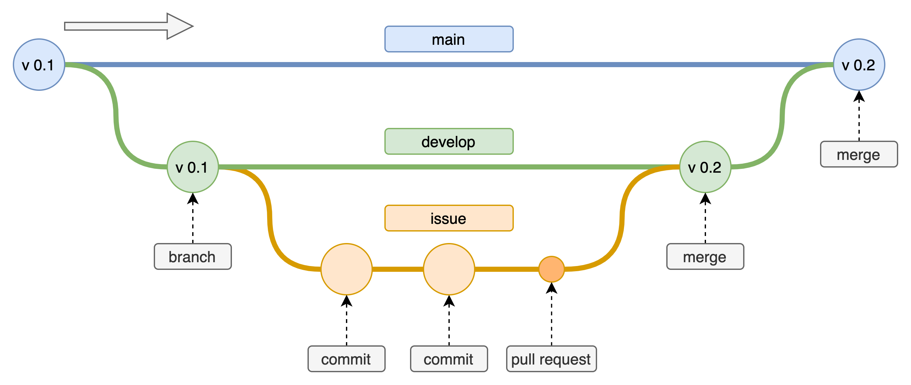

<p align="center">
	<a href="#" title="git-github">
		
	</a>
</p>

<p align="center">Demo trabalhando com versionamento em seus projetos</p>


# :receipt: Introdução

󠁐Projeto com objetivo de mostrar de forma básica o `funcionamento do sistemas de controle de versão com Git`, 
seus comandos de inicialização de repositório local, commits, push, merge, pull e muitos outros. Vou também demonstrar a conecxão
com github via chave `SSH`, para poder `subir os projetos para github`.


## :pushpin: Installation

:speech_balloon: Para trabalhar com controle de versão, você vai precisar:

> Instalar o [`Git`](https://git-scm.com/)
> Criar uma conta no [`GitHub`](https://github.com/)


### :zap: Configurações de variaveis globais

:speech_balloon: É importante nos identificarmos para o Git, Definindo nome de usuario e endereço de e-mail para os commits.

- git config --global user.name "Fulano da Silva"
- git config --global user.email fulanodasilva.git@gmail.com
- Pode verificar todos dados com comando `git config –list`.


### :zap: Comandos basicos para versionamento de repositório local para github

:speech_balloon: Iniciando repositório local

- O `git init` é o primeiro comando que devemos realizar para iniciar o controle de versão, pois é com este comando,
que iniciamos o repositório local.
- O `git status` verifica o status atual do repositório criado para o projeto.
- O `git log` verifica e passa uma lista de todos commits realizado no repositório e com varios dados como `hash` do commit, autor, data `branch`.
- O `git add` coloca os arquivos não preparados, monitorados na área de preparação `staging area`. E o add pode ser arquivo por arquivo `git add name.txt` ou todos `git add .`.
- O `git commit -m ":tada: Commit message"` registra alterações no repositório git salvando uma mensagem de log junto com um `id hash` do commit.

```
    git init
    git status
    git log
    git add .
    git commit -m ":tada: first commit"
```

### :key: Criando conexão git e github com chave SSH

:speech_balloon: Você pode usar SSH para realizar operações Git em repositórios em GitHub.com. Para obter mais informações, 
consulte [Sobre SSH :old_key:](https://docs.github.com/pt/authentication/connecting-to-github-with-ssh) ou [add ssh key](https://docs.github.com/pt/authentication/connecting-to-github-with-ssh/adding-a-new-ssh-key-to-your-github-account?platform=windows). 
Se você tiver uma chave SSH existente, poderá usá-la para autenticar operações do Git por SSH.

> Com o Git Bash aberto execute:

```
    ssh-keygen -t ed25519 -C "your_email@example.com"
```

:speech_balloon: Quando você for solicitado a `Inserir um arquivo no qual salvar a chave`, pressione `Enter` para aceitar o local padrão 
do arquivo.Observe que, se você criou chaves SSH anteriormente, o ssh-keygen pode solicitar que você reescreva outra chave; 
nesse caso, recomendo a criação de uma chave SSH com nome personalizado. Para fazer isso, digite o local padrão 
do arquivo e substitua id_ssh_keyname pelo nome de sua chave personalizada.

Agora basta `copiar a chave` e depois ir na sua conta no github para criar a nova chave SSH.

```
    clip < ~/.ssh/id_ed25519.pub
```

## :pushpin: Padrões de commits

:speech_balloon: De acordo com a documentação do **[Conventional Commits](https://www.conventionalcommits.org/pt-br)**, commits semânticos 
são uma convenção simples para ser utilizada nas mensagens de commit. Essa convenção define um conjunto de regras para 
criar um histórico de commit explícito, o que facilita a criação de ferramentas automatizadas. Esses commits auxiliarão 
você e sua equipe a entenderem de forma facilitada quais alterações foram realizadas no trecho de código que foi commitado.

#### :zap: Tipo e descrição

:speech_balloon: O commit semântico possui os elementos estruturais abaixo (tipos), que informam a intenção do seu commit ao utilizador(a) de seu código.

- `feat`- Commits do tipo feat indicam que seu trecho de código está incluindo um **novo recurso** (se relaciona com o MINOR do versionamento semântico).

- `fix` - Commits do tipo fix indicam que seu trecho de código commitado está **solucionando um problema** (bug fix), (se relaciona com o PATCH do versionamento semântico).

- `docs` - Commits do tipo docs indicam que houveram **mudanças na documentação**, como por exemplo no Readme do seu repositório. (Não inclui alterações em código).

- `test` - Commits do tipo test são utilizados quando são realizadas **alterações em testes**, seja criando, alterando ou excluindo testes unitários. (Não inclui alterações em código)

- `build` - Commits do tipo build são utilizados quando são realizadas modificações em **arquivos de build e dependências**.

- `perf` - Commits do tipo perf servem para identificar quaisquer alterações de código que estejam relacionadas a **performance**.

- `style` - Commits do tipo style indicam que houveram alterações referentes a **formatações de código**, semicolons, trailing spaces, lint... (Não inclui alterações em código).

- `refactor` - Commits do tipo refactor referem-se a mudanças devido a **refatorações que não alterem sua funcionalidade**, como por exemplo, uma alteração no formato como é processada determinada parte da tela, mas que manteve a mesma funcionalidade, ou melhorias de performance devido a um code review.

- `chore` - Commits do tipo chore indicam **atualizações de tarefas** de build, configurações de administrador, pacotes... como por exemplo adicionar um pacote no gitignore. (Não inclui alterações em código)

- `ci` - Commits do tipo ci indicam mudanças relacionadas a **integração contínua** (_continuous integration_).


#### :zap: Padrões de emojis
<table>
  <thead>
    <tr>
      <th>Tipo do commit</th>
      <th>Emoji</th>
      <th>Palavra-chave</th>
    </tr>
  </thead>
 <tbody>
    <tr>
      <td>Acessibilidade</td>
      <td>♿ <code>:wheelchair:</code></td>
      <td></td>
    </tr>
    <tr>
      <td>Adicionando um teste</td>
      <td>✅ <code>:white_check_mark:</code></td>
      <td><code>test</code></td>
    </tr>
    <tr>
      <td>Adicionando uma dependência</td>
      <td>➕ <code>:heavy_plus_sign:</code></td>
      <td><code>build</code></td>
    </tr>
    <tr>
      <td>Alterações de revisão de código</td>
      <td>👌 <code>:ok_hand:</code></td>
      <td><code>style</code></td>
    </tr>
    <tr>
      <td>Animações e transições</td>
      <td>💫 <code>:dizzy:</code></td>
      <td></td>
    </tr>
    <tr>
      <td>Bugfix</td>
      <td>🐛 <code>:bug:</code></td>
      <td><code>fix</code></td>
    </tr>
    <tr>
      <td>Comentários</td>
      <td>💡 <code>:bulb:</code></td>
      <td><code>docs</code></td>
    </tr>
    <tr>
      <td>Commit inicial</td>
      <td>🎉 <code>:tada:</code></td>
      <td><code>init</code></td>
    </tr>
    <tr>
      <td>Configuração</td>
      <td>🔧 <code>:wrench:</code></td>
      <td><code>chore</code></td>
    </tr>
    <tr>
      <td>Deploy</td>
      <td>🚀 <code>:rocket:</code></td>
      <td></td>
    </tr>
    <tr>
      <td>Documentação</td>
      <td>📚 <code>:books:</code></td>
      <td><code>docs</code></td>
    </tr>
    <tr>
      <td>Em progresso</td>
      <td>🚧 <code>:construction:</code></td>
      <td></td>
    </tr>
    <tr>
      <td>Estilização de interface</td>
      <td>💄 <code>:lipstick:</code></td>
      <td><code>feat</code></td>
    </tr>
    <tr>
      <td>Infraestrutura</td>
      <td>🧱 <code>:bricks:</code></td>
      <td><code>ci</code></td>
    </tr>
    <tr>
      <td>Lista de ideias (tasks)</td>
      <td>🔜 <code> :soon: </code></td>
      <td></td>
    </tr>
    <tr>
      <td>Mover/Renomear</td>
      <td>🚚 <code>:truck:</code></td>
      <td><code>chore</code></td>
    </tr>
    <tr>
      <td>Novo recurso</td>
      <td>✨ <code>:sparkles:</code></td>
      <td><code>feat</code></td>
    </tr>
    <tr>
      <td>Package.json em JS</td>
      <td>📦 <code>:package:</code></td>
      <td><code>build</code></td>
    </tr>
    <tr>
      <td>Performance</td>
      <td>⚡ <code>:zap:</code></td>
      <td><code>perf</code></td>
    </tr>
    <tr>
        <td>Refatoração</td>
        <td>♻️ <code>:recycle:</code></td>
        <td><code>refactor</code></td>
    </tr>
    <tr>
      <td>Removendo um arquivo</td>
      <td>🔥 <code>:fire:</code></td>
      <td></td>
    </tr>
    <tr>
      <td>Removendo uma dependência</td>
      <td>➖ <code>:heavy_minus_sign:</code></td>
      <td><code>build</code></td>
    </tr>
    <tr>
      <td>Responsividade</td>
      <td>📱 <code>:iphone:</code></td>
      <td></td>
    </tr>
    <tr>
      <td>Revertendo mudanças</td>
      <td>💥 <code>:boom:</code></td>
      <td><code>fix</code></td>
    </tr>
    <tr>
      <td>Segurança</td>
      <td>🔒️ <code>:lock:</code></td>
      <td></td>
    </tr>
    <tr>
      <td>SEO</td>
      <td>🔍️ <code>:mag:</code></td>
      <td></td>
    </tr>
    <tr>
      <td>Tag de versão</td>
      <td>🔖 <code>:bookmark:</code></td>
      <td></td>
    </tr>
    <tr>
      <td>Teste de aprovação</td>
      <td>✔️ <code>:heavy_check_mark:</code></td>
      <td><code>test</code></td>
    </tr>
    <tr>
      <td>Testes</td>
      <td>🧪 <code>:test_tube:</code></td>
      <td><code>test</code></td>
    </tr>
    <tr>
      <td>Texto</td>
      <td>📝 <code>:pencil:</code></td>
      <td></td>
    </tr>
    <tr>
      <td>Tipagem</td>
      <td>🏷️ <code>:label:</code></td>
      <td></td>
    </tr>
    <tr>
      <td>Tratamento de erros</td>
      <td>🥅 <code>:goal_net:</code></td>
      <td></td>
    </tr>
  </tbody>
</table>

#### 💻 Exemplos

<table>
  <thead>
    <tr>
      <th>Comando Git</th>
      <th>Resultado no GitHub</th>
    </tr>
  </thead>
 <tbody>
    <tr>
      <td>
        <code>git commit -m ":tada: Commit inicial"</code>
      </td>
      <td>🎉 Commit inicial</td>
    </tr>
    <tr>
      <td>
        <code>git commit -m ":books: docs: Atualizaçao do README"</code>
      </td>
      <td>📚 docs: Atualizaçao do README</td>
    </tr>
    <tr>
      <td>
        <code>git commit -m ":bug: fix: Loop infinito na linha 50"</code>
      </td>
      <td>🐛 fix: Loop infinito na linha 50</td>
    </tr>
    <tr>
      <td>
        <code>git commit -m ":sparkles: feat: Pagina de login"</code>
      </td>
      <td>✨ feat: Pagina de login</td>
    </tr>
    <tr>
      <td>
        <code>git commit -m ":bricks: ci: Modificaçao no Dockerfile"</code>
      </td>
      <td>🧱 ci: Modificaçao no Dockerfile</td>
    </tr>
    <tr>
      <td>
        <code>git commit -m ":recycle: refactor: Passando para arrow functions"</code>
      </td>
      <td>♻️ refactor: Passando para arrow functions</td>
    </tr>
    <tr>
      <td>
        <code>git commit -m ":zap: perf: Melhoria no tempo de resposta"</code>
      </td>
      <td>⚡ perf: Melhoria no tempo de resposta</td>
    </tr>
    <tr>
      <td>
        <code>git commit -m ":boom: fix: Revertendo mudanças ineficientes"</code>
      </td>
      <td>💥 fix: Revertendo mudanças ineficientes</td>
    </tr>
    <tr>
      <td>
        <code>git commit -m ":lipstick: feat: Estilizaçao CSS do formulario"</code>
      </td>
      <td>💄 feat: Estilizaçao CSS do formulario</td>
    </tr>
    <tr>
      <td>
        <code>git commit -m ":test_tube: test: Criando novo teste"</code>
      </td>
      <td>🧪 test: Criando novo teste</td>
    </tr>
    <tr>
      <td>
        <code>git commit -m ":bulb: docs: Comentários sobre a função LoremIpsum( )"</code>
      </td>
      <td>💡 docs: Comentários sobre a função LoremIpsum( )</td>
    </tr>
  </tbody>
</table>


## :zap: Iniciando repositório **local para subir no servidor github**

#### Como `clonar` um repositório do servidor do `github`:question: 
:speech_balloon: Adicionamos o comando `git clone ` + `ssh code` do repositório github. Conforme abaixo, vamos baixar o projeto em um diretório.

```
    git clone git@github.com:RafaelBlum/demo-git-github.git
```

:speech_balloon: Podemos também definir uma pasta ao clonar um repositório.

```
    git clone git@github.com:RafaelBlum/demo-git-github.git nomeDiretório
```


:speech_balloon: Depois de cria a chave, basta criar um repositório no github e seguir os comandos abaixo.

```
    git remote add origin git@github.com:RafaelBlum/demo-git-github.git
    git branch -M main
    git push -u origin main
```

:speech_balloon: Como enviar as alterações realizadas no seu projeto.

```
    git status
    git add .
    git commit -m "Alterações na feature x"
    git push
```

#### Mensagens de pré e pós commits</sub>

- :heavy_check_mark: Untracked files `Arquivos não rastreados no controle de vesão`
- :heavy_check_mark: Changes to be committed `Arquivos rastreados no controle de versão`
- :heavy_check_mark: Changes not staged for committed `Arquivos rastreados, mas com alterações`

#### Histórico de commits e alterações
```
    git log
    git reflog
    git log --stat
    git log --oneline
```


#### Mostra o conteúdo que foi alterado, mas antes do commit
```
gif diff
```

#### Mostra arquivo que foi alterado, mas antes do commit
```
gif diff --name-only
```

#### Remove alterações realizadas em algum arquivo especifico
```
git checkout HEAD -- style.css
```

#### Como voltar para alguma alteração commitada `voltar na sua linha do tempo`

```
git reflog
git reset --hard id_commit
```

## :zap: Branchs

#### Trabalhando nas linhas do tempo.

<p align="center">
	<a href="#" title="git-github">
		
	</a>
</p>

:speech_balloon: Como podemos ver, trabalhar com git é como se estivessemos em uma `máquina do tempo`, onde `podemos voltar` na nossa linha do 
tempo, o que chamamos de `commits`, voltando no inicio do projeto ou em qulquer momento.

Agora vamos utilizar outro poder do tempo, o poder de criar uma `linha do tempo em paralelo`, o que chamamos de `branchs`.
Estas linhas, branchs, usamos quando vamos desenvolver uma feature nova ou quando vamos `trabalhar em equipe`, pois assim
todos podemos trabalhar em uma parte do projeto sem que haja problemas em nosso projeto que está funcionando corretamente.

> Desta forma, podemos ter um desenvolvedor trabalhando na branch 2, na página de produtos e outro desenvolvedor trabalhando na branch 1, com a Home.

#### Verificar qual branch esta ativo e quais existem

```
git branch
```

#### Como criar um branch `linha do tempo`

```
git branch new_feature
```

#### Como passar para uma branch `linha do tempo`

```
git checkout new_feature
git branch
```

##### ou podemos criar a branch e já passr para ela.

```
git checkout -b new_feature
```

<p align="center">
	<a href="#" title="git-github">
		
	</a>
</p>

:speech_balloon: Agora temos duas linhas do tempo `main` e `new_feature`. Podemos subir mais uma Branch para github (remoto).

```
Git push origin branch-name
```

#### Remover uma branch remoto
```
Git push origin :branch-name
```


#### Remover branch local
```
Git branch –D branch-name
```

#### Como fazer Git Merge e pull

:speech_balloon: Antes de fazer o `merge` é importante fazer um `pull` no projeto `remoto Github`, puxando e atulizando para o projeto local, pois
pode acontecer de outro desenvolvedor tenha modificado algo, então na branch `main`.

```
git pull origin branch-name
git push --set-upstream origin branch-name
```

Agora sim, podemos fazer o merge

```
git branch
git merge branch_name
```

<p align="center">
	<a href="#" title="merge">
		
	</a>
</p>

`Ex:` Uma empresa pede para o desenvolvedor `criar um sistema de login`, mas ele não pode afetar o sistema principal ou o desenvolvimento
dos outros desenvolvedores. E ao finalizar, ele deve passar seu código para um `pull request`.

Se você quiser `criar um branch e fazer o checkout` ao mesmo tempo, use o comando git checkout. O parâmetro `-b` especifica o nome do branch.

Criou um nova branch `copiando a main`
```
git checkout -b sistema-de-login main
```

Agora alteramos para a branch que queremos atualizar `merge`.

```
git checkout main
git pull
git merge sistema-de-login
git push
```

Depois de pronta a nova feature e enviada a branch nova para github, você no github, vai criar uma pull request que será aprovada ou não pela equipe.

<p align="center">
	<a href="#" title="merge">
		
	</a>
</p>

## :zap: Pull - `Trabalhando na mesma branch`

:speech_balloon: Algumas vezes podemos trabalhar na mesma branch e computadores dferentes ou com outros usuários e antes de iniciair, precisamos
atualizar o código para o atual no github, conforme os commits forem sendo realizados.

O comando abaixo do `git atualizar os arquivos do repositório remoto`.
Execute:
```
    git pull
```

Caso o git pull gere uma :x:mensagem:x:

>error:x:: Your local changes to the following files would be overwritten by merge
>...
>Please commit your changes or stash them before you merge.
>Aborting

A :heavy_check_mark: `solução` que pode ser feita: Utilizar um `git stash` para gravar o estado atual do seu repositório local, revertendo os 
arquivos para o estado atual do repositório remoto.

```
 git stash push --include-untracked
```
E agora sim o `pull irá funcionar`:
```
 git pull
```

<br>

### Contatos

Contatos 👇🏼 [rafaelblum_digital@hotmail.com]

[](https://www.youtube.com/channel/UCMvtn8HZ12Ud-sdkY5KzTog)
[](https://www.instagram.com/rafablum_/)
[](https://twitter.com/universoCode)
[](https://www.linkedin.com/in/rafael-blum-237133114/)
[](https://github.com/RafaelBlum)

<br/>

 <em><b>Adoro me conectar com pessoas diferentes,</b> então se você quiser dizer <b>oi, ficarei feliz em conhecê-lo mais!</b> :)</em>
